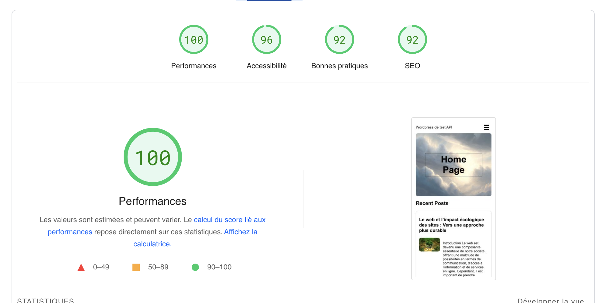
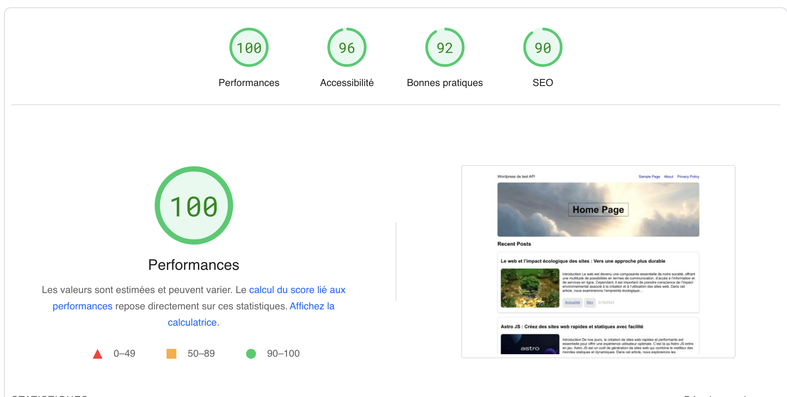

Example of this project : https://astropress.eraertsalan.be/

to add in any wp functions.php from ur active theme , reading-options must not be set to static page.

    function triggerGitHubAction() {
    $api_url = 'https://api.github.com/repos/<GITHUBUSERNAME>/<REPOSITORYNAME>/actions/workflows/<WORKFLOWID>/dispatches';

    $data = array(
        'ref' => 'refs/heads/master',
        'inputs' => array(
            'branch' => 'master'
        )
    );

    $headers = array(
        'Content-type: application/json',
        'Authorization: Bearer <YOUR GITHUB TOKEN>',
        'User-Agent: <REPOSITORYNAME>'
    );

    $ch = curl_init();
    curl_setopt($ch, CURLOPT_URL, $api_url);
    curl_setopt($ch, CURLOPT_HTTPHEADER, $headers);
    curl_setopt($ch, CURLOPT_POST, 1);
    curl_setopt($ch, CURLOPT_POSTFIELDS, json_encode($data));
    curl_setopt($ch, CURLOPT_RETURNTRANSFER, true);
    $response = curl_exec($ch);

    if ($response === FALSE) {
        $error = curl_error($ch);
        // Gérer l'erreur de cURL
        echo 'Erreur cURL : ' . $error;
    } else {
        // Succès, l'action GitHub a été déclenchée
        // La réponse complète de l'API GitHub est contenue dans la variable $response
        // Vous pouvez effectuer le traitement nécessaire sur la réponse
        echo 'Réponse de l\'API GitHub : ' . $response;
    }

    curl_close($ch);
    }

    function add_custom_admin_button() {
    global $wp_admin_bar;
    $workflow_id = <WORKFLOWID>; // Remplacez par l'ID de votre workflow
    $button_args = array(
        'id'    => 'trigger-github-action',
        'title' => 'Déclencher l\'action GitHub',
        'href'  => wp_nonce_url( admin_url( 'admin-ajax.php?action=trigger_github_action' ), 'trigger_github_action' ),
        'meta'  => array( 'class' => 'trigger-github-action-button' )
    );
    $wp_admin_bar->add_node( $button_args );
    }
    add_action( 'admin_bar_menu', 'add_custom_admin_button', 100 );

    // Gérer le déclenchement de l'action via AJAX
    function trigger_github_action() {
    // Vérifier la validité du jeton de sécurité
    check_ajax_referer( 'trigger_github_action', 'security' );
    
        // Appeler la fonction PHP triggerGitHubAction() via une requête AJAX
        triggerGitHubAction();
    }
    add_action( 'wp_ajax_trigger_github_action', 'trigger_github_action' );
    add_action( 'wp_ajax_nopriv_trigger_github_action', 'trigger_github_action' );
    function new_excerpt_more($more) {
        global $post;
        remove_filter('excerpt_more', 'new_excerpt_more');
        return ' <a class="read_more" href="'. get_permalink($post->ID) . '">' . ' do whatever you want to update' . '</a>';
    }
    add_filter('excerpt_more','new_excerpt_more',11);

``
